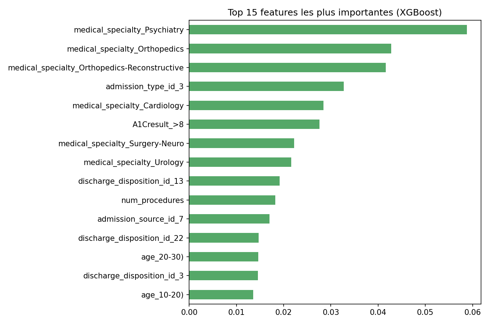
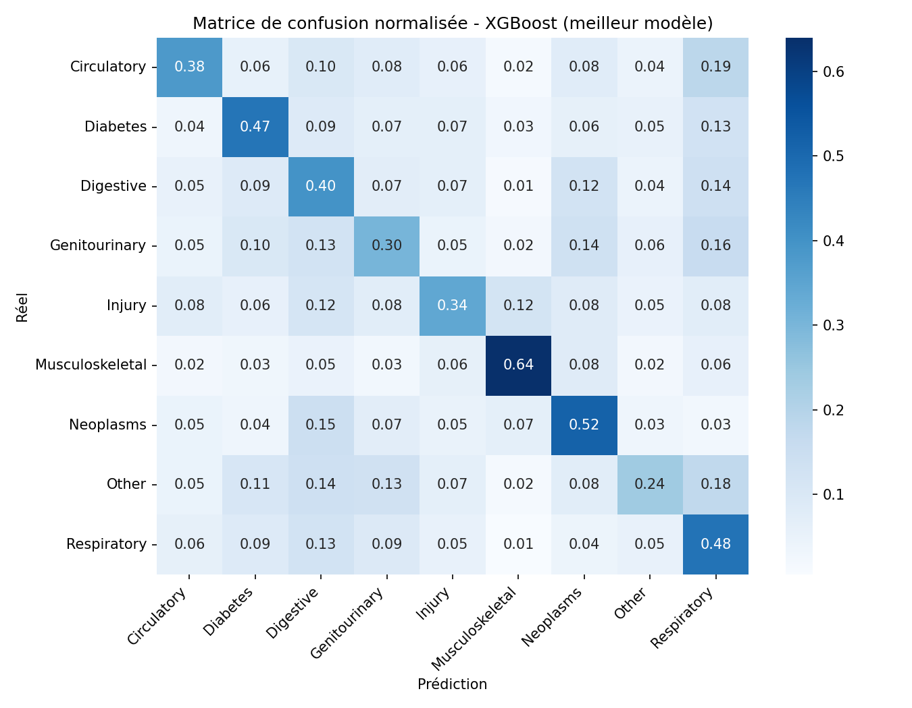

# Classification de la catégorie diagnostique à partir de données hospitalières

Projet de Machine Learning appliqué à des données hospitalières réelles : prédire la **catégorie diagnostique principale** d'un patient (circulatoire, respiratoire, diabète, etc.) à partir de ses caractéristiques d'admission, sans utiliser le code diagnostic lui-même.

## Contexte

Le dataset **[Diabetes 130-US hospitals (1999-2008)](https://archive.ics.uci.edu/dataset/296/diabetes+130-us+hospitals+for+years+1999-2008)** rassemble ~100 000 admissions hospitalières de patients diabétiques dans 130 hôpitaux américains, sur 10 ans. Chaque ligne contient des informations démographiques, des résultats de laboratoire, les traitements administrés et jusqu'à 3 codes de diagnostic ICD-9.

**Objectif du projet** : à partir des données d'admission (âge, spécialité médicale, type d'admission, durée de séjour, résultats de tests, médicaments...), prédire la **catégorie du diagnostic principal** (`diag_1`) parmi 9 grandes familles cliniques (Circulatory, Respiratory, Digestive, Diabetes, Injury, Musculoskeletal, Genitourinary, Neoplasms, Other).

C'est un problème de **classification multi-classes** avec un fort déséquilibre entre classes (les diagnostics circulatoires représentent ~30 % des cas contre ~5 % pour les néoplasmes).

## Données

- Source : [UCI Machine Learning Repository](https://archive.ics.uci.edu/dataset/296/diabetes+130-us+hospitals+for+years+1999-2008), licence CC BY 4.0
- 101 766 admissions, 50 variables d'origine
- Le fichier `data/diabetic_data.csv` n'est pas trop volumineux (~19 Mo) et est inclus dans ce repo pour la reproductibilité. Si tu préfères ne pas le committer, télécharge-le depuis UCI et place-le dans `data/`.

## Méthodologie

### 1. Construction de la cible
Les codes ICD-9 bruts (`diag_1`, ~700 valeurs uniques) sont regroupés en **9 catégories cliniques**, selon le même regroupement que l'étude originale de Strack et al. (2014) — voir `src/icd9_mapping.py`.

### 2. Prétraitement
- **1 admission par patient** (on garde la première visite) pour éviter toute fuite d'information entre train/test liée aux patients réadmis plusieurs fois
- Suppression des identifiants et des colonnes trop incomplètes (`weight`: 97 % manquant, `payer_code`)
- Encodage one-hot des variables catégorielles (spécialité médicale, type d'admission, traitements...)
- Split stratifié train/test (80/20)

⚠️ Les colonnes `diag_2` et `diag_3` (co-diagnostics) sont volontairement exclues des features : elles sont trop corrélées à `diag_1` et créeraient une fuite d'information qui fausserait l'évaluation.

### 3. Modélisation
Trois modèles sont comparés :
- **Régression logistique multinomiale** (baseline)
- **Random Forest**
- **XGBoost**

Le déséquilibre de classes est géré par pondération (`class_weight='balanced'` / `sample_weight`). La métrique principale est le **F1-macro**, plus robuste que l'accuracy face au déséquilibre : elle donne le même poids à chaque classe, y compris les plus rares.

## Résultats

| Modèle               | Accuracy | F1-macro |
|----------------------|----------|----------|
| Logistic Regression   | 0.352    | 0.333    |
| Random Forest         | 0.400    | 0.370    |
| **XGBoost**           | 0.392    | **0.377** |

XGBoost obtient le meilleur F1-macro et est retenu comme modèle final.

**À noter** : ces scores peuvent sembler modestes (~38 %) comparés à un problème de classification "classique". C'est attendu ici : de nombreuses pathologies partagent des profils d'admission très proches (durée de séjour, médicaments, tests de labo similaires), et le diagnostic précis dépend souvent d'informations cliniques (imagerie, examens spécifiques) absentes de ce dataset. Le modèle reste néanmoins nettement au-dessus du hasard (~11 % pour 9 classes équilibrées, et la classe majoritaire seule ferait ~30 %).

### Feature importance (XGBoost)
Les variables les plus prédictives sont, sans surprise, liées à la **spécialité médicale du service d'admission** (psychiatrie, orthopédie, cardiologie...) et au **type/source d'admission** — logique, puisqu'un patient admis en cardiologie a une probabilité bien plus élevée d'avoir un diagnostic circulatoire.



### Matrice de confusion


La classe **Circulatory** (majoritaire) est la mieux prédite. Les classes **Other** et **Injury** sont les plus confondues avec les autres, car elles regroupent des diagnostics hétérogènes.

## Structure du projet

```
diagnosis-classification/
├── data/
│   └── diabetic_data.csv          # dataset brut (UCI)
├── src/
│   ├── icd9_mapping.py            # regroupement des codes ICD-9 en catégories
│   ├── preprocessing.py           # nettoyage + encodage + split train/test
│   ├── eda.py                     # génère les figures d'analyse exploratoire
│   └── train.py                   # entraîne et compare les 3 modèles
├── models/
│   ├── best_model.joblib          # modèle XGBoost entraîné
│   ├── target_encoder.joblib
│   └── feature_columns.joblib
├── reports/
│   ├── figures/                   # visualisations EDA + résultats
│   ├── model_comparison.csv
│   └── classification_report_best_model.json
├── requirements.txt
└── README.md
```

## Reproduire les résultats

```bash
pip install -r requirements.txt

# Analyse exploratoire (génère reports/figures/01 à 04)
python src/eda.py

# Entraînement + comparaison des modèles (génère reports/figures/05-06, models/)
python src/train.py
```

## Limites et pistes d'amélioration

- **Données anciennes** (1999-2008) : les pratiques médicales et les codes diagnostiques (ICD-9, remplacé par ICD-10) ont évolué depuis
- **Généralisabilité** : dataset américain uniquement, spécifique aux patients diabétiques hospitalisés — pas transposable tel quel à d'autres pays ou populations
- **Variables non disponibles** : le dataset ne contient pas de données d'imagerie, de biologie fine ou de comptes-rendus cliniques qui amélioreraient probablement fortement la prédiction
- **Pistes** : gestion plus fine du texte libre (`medical_specialty` a beaucoup de catégories rares), embeddings pour les codes ICD-9 plutôt qu'un regroupement en 9 classes, modèles de gradient boosting avec tuning d'hyperparamètres (Optuna/GridSearch)

## Licence des données

Dataset original sous licence **CC BY 4.0** — Strack, B., DeShazo, J.P., Gennings, C., Olmo, J.L., Ventura, S., Cios, K.J., & Clore, J.N. (2014). *Impact of HbA1c Measurement on Hospital Readmission Rates: Analysis of 70,000 Clinical Database Patient Records*. BioMed Research International.
